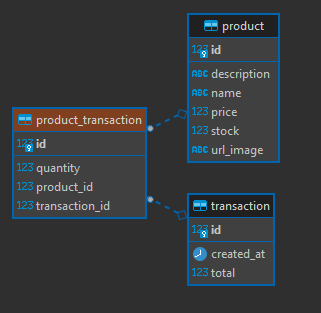

# Soal test maggang Backend engineer dengan Springboot

Berikut adalah soal/pertanyaan yang perlu dijawab oleh peserta maggang

## knowledge base

1. Apa yang anda ketahui tentang Rest API?
2. Apa yang anda ketahui tentang Server side and Client side processing?
3. Apa yang anda ketahui tentang Monolith dan Microservices, berikan contohnya?
4. Apa yang anda ketahui tentang Design pattern inversion of Control serta Dependency Injection?
5. Apa yang anda ketahui tentang Java programming dan Spring framework khususnya spring-boot?

## Design modules

Dalam suatu schenario ada requirement membuat aplikasi e-commerse seperti Tokopedia seperti berikut:

1. Catalog, pelanggan mencari product di toko
    
2. Item, bisa melihat detail informasi produk
    
3. Cart, pelanggan bisa menambahkan produk yang ingin di beli ke keranjang
    
4. Setelah di checkout, masuk ke list transaction
    
5. Kita juga bisa liat detail transactionya
    

Kemudian temen-temen buat design database, module (monolith/microservices) berdasarkan gambar atau schenario tersebut. Serta jelakan mengapa menggunakan design tersebut.

## Praktek

Berdasarkan analisa tersebut, buat project monorepo (pada repository ini) dengan menggunakan framework springboot seperti berikut specifikasinya:

- Database: `PostgreSQL 15`
- JDK version: `Oracle JDK 17 or later`
- Springboot version: `3.0.x`

terkait design system Toko, Barang, Pembelian pada ecommerse tersebut.

## Jawaban knowledge base

1. Rest API adalah sebuah metode komunikasi menggunakan protocol HTTP. Dimana klien mengirim permintaan HTTP ke server untuk mengakses data, kemudian server memproses permintaan dan mengirimkan respon Kembali kepada klien. Rest API ini yang memungkinkan kita mendapat data dari server sehingga dapat digunakan diberbagai aplikasi yang berbeda melalui standar HTTP dan format data seperti JSON atau XML.
2. Server-side processing merupakan sebuah pemrosesan data/logika yang terjadi di server. Dimana server menerima permintaan dari klien, memprosesnya, kemudian mengirimkan kembali respons kepada klien. 	Server-side processing merupakan sebuah pemrosesan data/logika yang terjadi di server. Dimana server menerima permintaan dari klien, memprosesnya, kemudian mengirimkan kembali respons kepada klien.
3. Server-side processing merupakan sebuah pemrosesan data/logika yang terjadi di server. Dimana server menerima permintaan dari klien, memprosesnya, kemudian mengirimkan kembali respons kepada klien. 	Microservices adalah sebuah model arsitektur dimana masing-masing fitur dibuat service yang terpisah satu sama lainnya. Sehingga setiap service ini akan saling berkomunikasi melalui protocol. Contoh penerapan microservice terdapat pada aplikasi Gojek, aplikasi ini memiliki beberapa jenis service seperti GoRIde, GoPay, GoFood, dan lain sebagainya.
4. Inversion of Control dan Dependency Injection adalah dua konsep yang saling terkait satu sama lain dalam pengembangan aplikasi. Inversion of Control (IoC) adalah prinsip desain yang mengubah aliran kontrol dalam aplikasi. Dengan IoC, kontrol atas pembuatan dan pengelolaan objek-objek yang diperlukan dalam aplikasi dipindahkan ke suatu wadah yang disebut IoC Container. Dependency Injection (DI) adalah teknik yang digunakan untuk menerapkan prinsip IoC.
5. Java programming merupakan proses pengembangan aplikasi menggunakan bahasa pemrograman java. Java adalah bahasa yang dapat digunakan untuk membuat berbagai jenis aplikasi sepeti aplikasi desktop, web, dan mobile.	Spring Framework merupakan sebuah kerangka kerja yang popular karena menyediakan kerangka kerja yang kuat, mudah digunakan, dan memiliki komunitas pengembang yang besar. Spring Framework biasa digunakan untuk pengembangan aplikasi menggunakan bahasa pemrograman Java. Spring Boot merupakan sub-project Spring yang digunakan untuk memudahkan dalam pengembangan aplikasi Java yang berdiri sendiri dan siap pakai. Spring Boot menyediakan fitur konfigurasi otomatis, server web terintegrasi, manajemen dependensi, dan fitur-fitur lainnya yang dapat mempercepat pengembangan aplikasi.

## Design Database 
